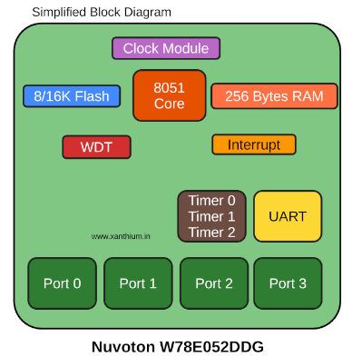

# 8051-Embedded-Systems-Development-Soldering-Kit
The 8051 Embedded Systems Development Soldering Kit is purpose-built for engineering students who want to learn embedded systems hands-on during their B tech degree program where  8051 is taught as a foundational Microcontroller platform.   Our Embedded System Soldering Kit contains W78E052DDG (8051 Microcontroller) as the heart of the board interfaced to a ADC0804 Analog Digital Converter and a 7 Segment Display Unit for displaying information.

- 

- [How to program 8051 Microcontroller using USB Virtual COM Port & Nuvoton 8051 ICP-ISP Programmer](https://www.xanthium.in/upload-code-nuvoton-w788e052ddg-8051-microcontroller-usb-virtual-com-port-tutorial)